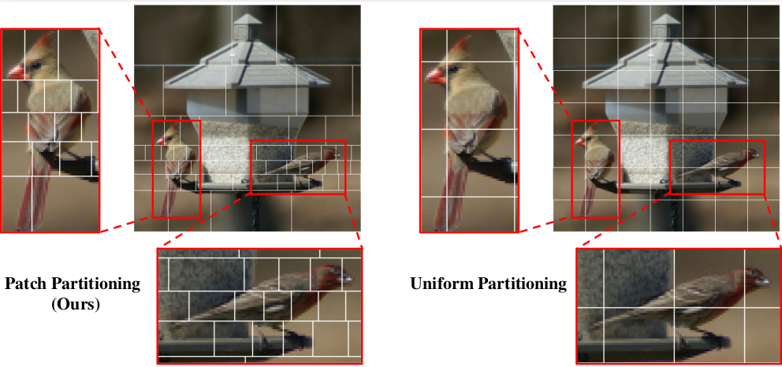

# DART: Differentiable Dynamic Adaptive Region Tokenizer for Vision Transformer and Mamba

[](https://pytorch.org/)
[](https://www.google.com/search?q=https://arxiv.org/abs/24XX.XXXXX) [](https://opensource.org/licenses/MIT)

This repository contains the official PyTorch implementation for the paper: **DART: Differentiable Dynamic Adaptive Region Tokenizer for Vision Transformer and Mamba**.

DART is a fully differentiable tokenizer that adaptively partitions images into content-dependent patches of varying sizes, allocating more tokens to information-rich regions. It can be seamlessly integrated into Vision Transformer (ViT) and Vision Mamba (Vim) architectures to enhance performance with minimal or even reduced computational overhead.

<p align="center">

</p>
<p align="center">
<em> DART adaptively allocates tokens, focusing on important regions (e.g., the bird) while using fewer tokens for the background. </em>
</p>

## Abstract

Recently, non-convolutional models such as the Vision Transformer (ViT) and Vision Mamba (Vim) have achieved remarkable performance in computer vision tasks. However, their reliance on fixed-size patches often results in excessive encoding of background regions and omission of critical local details, especially when informative objects are sparsely distributed. To address this, we introduce a *fully differentiable* **Dynamic Adaptive Region Tokenizer (DART)**, which *adaptively partitions images into content-dependent patches of varying sizes*. DART combines learnable region scores with piecewise differentiable quantile operations to allocate denser tokens to information-rich areas. Despite introducing only approximately 1 million (1M) additional parameters, DART improves accuracy by 2.1% on DeiT (ImageNet-1K). Unlike methods that uniformly increase token density to capture fine-grained details, DART offers a more efficient alternative, achieving a 45% FLOPs reduction with superior performance. Extensive experiments on DeiT, Vim, and VideoMamba confirm that DART consistently enhances accuracy while incurring minimal or even reduced computational overhead.

## Main Results

DART significantly boosts the performance of various backbones on the ImageNet-1K dataset while efficiently managing computational resources.

### Performance on Transformers and SSMs

DART consistently improves Top-1 accuracy for DeiT, Vim, and VideoMamba models. Notably, during long-sequence fine-tuning, DART achieves superior or comparable accuracy with a substantial reduction in GFLOPs.

| Backbone                 | Tokenizer          | Params (M) | Patches          | GFLOPs                   | Top-1 (%)             |
| ------------------------ | ------------------ | ---------- | ---------------- | ------------------------ | --------------------- |
| *Transformers* |                    |            |                  |                          |                       |
| DeiT-Ti                  |                    | 6          | 196              | 1.26                     | 72.2                  |
| DeiT-Ti                  | **DART** | 7          | 196              | 1.32                     | 73.8 **(+1.6)** |
| DeiT-S                   |                    | 22         | 196              | 4.61                     | 79.8                  |
| DeiT-S                   | **DART** | 24         | 196              | 4.84                     | 80.6 **(+0.8)** |
| DeiT-S†                  |                    | 22         | 576              | 15.5                     | 81.6                  |
| DeiT-S†                  | **DART** | 24         | **392** | 10.1 **(-35%)** | 81.8 **(+0.2)** |
| *SSMs* |                    |            |                  |                          |                       |
| Vim-Ti                   |                    | 7          | 196              | 1.60                     | 76.1                  |
| Vim-Ti                   | **DART** | 8          | 196              | 1.68                     | 77.2 **(+1.1)** |
| Vim-S                    |                    | 26         | 196              | 5.30                     | 80.5                  |
| Vim-S                    | **DART** | 29         | 196              | 5.55                     | 81.5 **(+1.0)** |
| VideoMamba-Ti            |                    | 7          | 196              | 1.08                     | 76.9                  |
| VideoMamba-Ti            | **DART** | 8          | 196              | 1.15                     | 78.2 **(+1.3)** |
| Vim-Ti†                  |                    | 7          | 784              | 5.95                     | 78.3                  |
| Vim-Ti†                  | **DART** | 8          | **392** | 3.29 **(-45%)** | 78.9 **(+0.6)** |
| Vim-S†                   |                    | 26         | 784              | 19.6                     | 81.6                  |
| Vim-S†                   | **DART** | 29         | **392** | 10.9 **(-44%)** | 82.2 **(+0.6)** |
| VideoMamba-Ti†           |                    | 7          | 784              | 4.30                     | 79.3                  |
| VideoMamba-Ti†           |                    | 7          | 1296             | 7.11                     | 79.6                  |
| VideoMamba-Ti†           | **DART** | 8          | **392** | 2.24 **(-69%)** | 79.7 **(+0.1)** |

> † denotes long‐sequence fine‐tuning.

### Comparison with Dynamic Tokenizers

DART demonstrates superior performance and efficiency compared to other dynamic inference methods for ViT.

| Model                 | Patches  | GFLOPs | Acc. (%) |
| --------------------- | -------- | ------ | -------- |
| A-ViT-T               | dynamic  | 0.8    | 71.0     |
| **DeiT-Ti + DART** | **121** | **0.8**| **71.8** |
| **DeiT-Ti + DART** | **196** | **1.3**| **73.8** |
| DeiT-S                | 196      | 4.61   | 79.8     |
| DynamicViT-S/0.5      | dynamic  | 7.0    | 80.3     |
| **DeiT-S + DART** | **196** | **4.8**| **80.6** |
| **DeiT-S + DART** | **392** | **10.1**| **81.8** |

### Ablation on Scoring Network

The choice of scoring backbone in DART offers a trade-off between parameter count and accuracy improvement.

| Scoring Network   | Params (M) | FLOPs | Top-1 (%)       |
| ----------------- | ---------- | ----- | --------------- |
| w/o (DeiT-Ti baseline)    | 6          | 1.26  | 72.2            |
| MobileNetV3 Small | 7          | 1.32  | 73.8 **(+1.6)** |
| MnasNet           | 7          | 1.37  | 74.0 **(+1.8)** |
| SqueezeNet        | 7          | 1.54  | 74.3 **(+2.1)** |
| EfficientNet-B0   | 10         | 2.41  | 75.1 **(+2.9)** |

## Installation

DART is designed as a self-contained component and has minimal dependencies.

1.  **Clone the repository:**

    ```bash
    git clone https://github.com/your-username/DART.git
    cd DART
    ```

2.  **Set up the environment:**
    DART's primary dependency is PyTorch. We recommend using a virtual environment.

    ```bash
    # Example using conda
    conda create -n dart_env python=3.10
    conda activate dart_env
    pip install torch torchvision torchaudio --index-url https://download.pytorch.org/whl/cu118
    ```

## Model Zoo

We provide pretrained model weights for various backbones enhanced with DART.

| Model                          | Download Link                               |
| ------------------------------ | ------------------------------------------- |
| **DeiT-Tiny variants** |                                             |
| `darvit-tiny.pth`              | [Link](https://huggingface.co/yinkx3/DART/blob/main/darvit-tiny.pth)                   |
| `darvit-tiny-v2.pth`           | [Link](https://huggingface.co/yinkx3/DART/blob/main/darvit-tiny-v2.pth)                |
| `darvit-tiny-ft121p.pth`       | [Link](https://huggingface.co/yinkx3/DART/blob/main/darvit-tiny-ft121p.pth)            |
| **DeiT-Small variants** |                                             |
| `darvit-sm.pth`                | [Link](https://huggingface.co/yinkx3/DART/blob/main/darvit-sm.pth)                     |
| `darvit-sm-ft144p.pth`         | [Link](https://huggingface.co/yinkx3/DART/blob/main/darvit-sm-ft144p.pth)              |
| `darvit-sm-ft288p.pth`         | [Link](https://huggingface.co/yinkx3/DART/blob/main/darvit-sm-ft288p.pth)              |
| `darvit-sm-ft392p.pth`         | [Link](https://huggingface.co/yinkx3/DART/blob/main/darvit-sm-ft392p.pth)              |
| **Vim variants** |                                             |
| `darvim-tiny.pth`              | [Link](https://huggingface.co/yinkx3/DART/blob/main/darvim-tiny.pth)                   |
| `darvim-tiny-ft2seq.pth`       | [Link](https://huggingface.co/yinkx3/DART/blob/main/darvim-tiny-ft2seq.pth)            |
| `darvim-sm.pth`                | [Link](https://huggingface.co/yinkx3/DART/blob/main/darvim-sm.pth)                     |
| `darvim-sm-ft2seq.pth`         | [Link](https://huggingface.co/yinkx3/DART/blob/main/darvim-sm-ft2seq.pth)              |
| **RMT variant** |                                             |
| `darmt-L6.pth`                 | [Link](https://huggingface.co/yinkx3/DART/blob/main/darmt-L6.pth)                      |

## Training and Evaluation

The training and evaluation scripts are adapted from the DeiT repository.

### Training

Use the following command for multi-GPU training. Hyperparameters should align with the baseline models.

```bash
python -m torch.distributed.launch --nproc_per_node=2 --master-port=29577 --use_env main.py \
--model darvit_tiny \
--batch-size 256 \
--data-path /path/to/your/imagenet \
--data-set IMNET \
--output_dir /path/to/save/models \
--input-size 448
```

### Evaluation

To evaluate a pretrained model, use the `--eval` flag.

```bash
python -m torch.distributed.launch --nproc_per_node=2 --master-port=29577 --use_env main.py \
--model darvit_tiny \
--batch-size 256 \
--data-path /path/to/your/imagenet \
--data-set IMNET \
--resume /path/to/your/darvit-tiny.pth \
--input-size 448 \
--eval
```

## Integrating DART with New Models

The core logic of DART is encapsulated in the `dart/` directory, designed as a standard Python package. To integrate DART into a new vision model, you can replace the standard static patch embedding layer with the DART module. See `models_deit.py` for an example of how DART is integrated into the DeiT architecture.

 ## Citation

If you find our work useful in your research, please consider citing our paper:

```bibtex
@article{yin2025dart,
  title={DART: Differentiable Dynamic Adaptive Region Tokenizer for Vision Transformer and Mamba},
  author={Shicheng Yin and Kaixuan Yin and Yang Liu and Weixing Chen and Liang Lin},
  journal={arXiv preprint arXiv:2506.10390},
  year={2025}
}
``` 
## Acknowledgements

This project is built upon the excellent work of several open-source repositories. We gratefully acknowledge the contributions from:

  * [DeiT (Data-efficient Image Transformers)](https://github.com/facebookresearch/deit)
  * [Vim (Vision Mamba)](https://github.com/hustvl/Vim)
  * [RMT (Region-based Masked Autoencoders)](https://github.com/qhfan/RMT) 
